# 🤖 Auto-Create Employee Feature - Sistem Absensi Solution X304

Fitur otomatis untuk membuat employee di database ketika ditemukan user baru di mesin absensi yang belum terdaftar.

## 🎯 **Problem yang Diselesaikan**

### **Skenario Masalah:**
1. Admin add user **"Budi"** dengan PIN **"99999"** di mesin Solution X304
2. Budi scan fingerprint → mesin simpan attendance log
3. Cron job sync data → cari employee dengan NIK/PIN **"99999"**
4. **Employee tidak ditemukan** di database
5. **Data attendance di-skip** dan tidak diproses
6. **Absensi Budi hilang!** ❌

### **Solusi dengan Auto-Create:**
1. Admin add user **"Budi"** dengan PIN **"99999"** di mesin
2. Budi scan fingerprint → mesin simpan log
3. Cron job sync → employee tidak ditemukan
4. **System otomatis create employee** dengan PIN **"99999"**
5. **Data attendance diproses normal** ✅
6. **Absensi Budi tersimpan!** ✅

## 🔧 **Cara Kerja Auto-Create**

### **Flow Diagram**

```mermaid
graph TD
    A["👆 Karyawan Scan<br/>Fingerprint"] --> B["📱 Mesin Simpan<br/>Attendance Log"]
    
    B --> C["⏰ Cron Job Sync<br/>Setiap 15 Menit"]
    C --> D["🔍 Cari Employee<br/>by PIN/NIK"]
    
    D --> E{"Employee<br/>Exists?"}
    E -->|Ya| F["✅ Process Normal<br/>Save to DB"]
    
    E -->|Tidak| G{"Auto-Create<br/>Enabled?"}
    G -->|Ya| H["🤖 Auto-Create<br/>Employee"]
    G -->|Tidak| I["❌ Skip Data<br/>Log Warning"]
    
    H --> J["📝 Create dengan Data:<br/>- NIK = PIN<br/>- Name = Employee_PIN<br/>- NumCard = PIN"]
    J --> K["✅ Process Attendance<br/>Save to DB"]
    
    K --> L["📊 Update Attendance<br/>Harian"]
    F --> L
```



### **Data Employee yang Auto-Created:**

```php
Employee::create([
    'nik' => $pin,                          // PIN dari mesin
    'nama_lengkap' => "Employee_{$pin}",    // Default name
    'NumCard' => $pin,                      // PIN sebagai card number
    'jabatan_saat_ini' => 'staff',          // Default jabatan
    'tanggal_masuk' => now()->format('Y-m-d'), // Hari ini
    'status_karyawan' => 'active',          // Status aktif
    'jenis_kelamin' => 'L',                 // Default laki-laki
    'created_from' => 'attendance_machine'  // Source identifier
]);
```

## ⚙️ **Configuration**

### **1. Enable Auto-Create**

```bash
# Di file .env
ATTENDANCE_AUTO_CREATE_EMPLOYEE=true
```

### **2. Disable Auto-Create (Default)**

```bash
# Di file .env  
ATTENDANCE_AUTO_CREATE_EMPLOYEE=false
```

## 🚀 **Setup dan Testing**

### **1. Enable Feature**

```bash
# Update .env
echo "ATTENDANCE_AUTO_CREATE_EMPLOYEE=true" >> .env

# Clear cache
php artisan config:clear
```

### **2. Test Scenario**

```bash
# 1. Add user di mesin dengan PIN yang belum ada di database
# Misal: PIN 88888, Name "Test User"

# 2. User scan fingerprint di mesin

# 3. Wait atau manual sync
php artisan attendance:sync --process --force

# 4. Check apakah employee auto-created
php artisan tinker
>>> App\Models\Employee::where('nik', '88888')->first()
>>> App\Models\Employee::where('created_from', 'attendance_machine')->get()
```

### **3. Monitor Auto-Create Activity**

```bash
# Monitor log real-time
tail -f storage/logs/laravel.log | grep "Auto-created"

# Check semua employee yang auto-created
php artisan tinker
>>> App\Models\Employee::where('created_from', 'attendance_machine')->get()
```

## 📊 **Monitoring dan Reporting**

### **1. List Auto-Created Employees**

```sql
-- SQL Query
SELECT 
    nik,
    nama_lengkap,
    NumCard,
    tanggal_masuk,
    created_at
FROM employees 
WHERE created_from = 'attendance_machine'
ORDER BY created_at DESC;
```

### **2. Laravel Query**

```php
// Get auto-created employees
$autoCreatedEmployees = Employee::where('created_from', 'attendance_machine')
    ->orderBy('created_at', 'desc')
    ->get();

// Count auto-created employees
$count = Employee::where('created_from', 'attendance_machine')->count();
```

### **3. API Endpoint untuk Monitoring**

```php
// Di AttendanceController
public function getAutoCreatedEmployees()
{
    $employees = Employee::where('created_from', 'attendance_machine')
        ->with(['attendances' => function($query) {
            $query->where('date', '>=', now()->subDays(30));
        }])
        ->orderBy('created_at', 'desc')
        ->get();

    return response()->json([
        'success' => true,
        'data' => $employees,
        'total' => $employees->count()
    ]);
}
```

## 🛡️ **Security dan Best Practices**

### **1. Environment Settings**

```bash
# Development: Enable untuk testing
ATTENDANCE_AUTO_CREATE_EMPLOYEE=true

# Production: Disable secara default untuk kontrol ketat
ATTENDANCE_AUTO_CREATE_EMPLOYEE=false
```

### **2. Data Validation**

```php
// System validasi PIN sebelum create
- PIN harus numeric
- PIN tidak boleh kosong
- PIN tidak boleh duplicate dengan employee existing
```

### **3. Data Cleanup**

```php
// Clean up auto-created employees yang tidak valid
Employee::where('created_from', 'attendance_machine')
    ->where('nama_lengkap', 'LIKE', 'Employee_%')
    ->whereDoesntHave('attendances')
    ->where('created_at', '<', now()->subDays(7))
    ->delete();
```

## 🚨 **Troubleshooting**

### **Problem: Employee tidak auto-created**

```bash
# 1. Check environment variable
php artisan tinker
>>> env('ATTENDANCE_AUTO_CREATE_EMPLOYEE')

# 2. Check log error
tail -f storage/logs/laravel.log | grep "Error auto-creating"

# 3. Test manual
php artisan attendance:sync --process --force
```

### **Problem: Duplicate employee created**

```bash
# Check duplicate berdasarkan NIK
SELECT nik, COUNT(*) 
FROM employees 
GROUP BY nik 
HAVING COUNT(*) > 1;

# Cleanup duplicate
# Manual review dan delete yang tidak diperlukan
```

### **Problem: Auto-created employee dengan data salah**

```bash
# Update employee data setelah auto-created
UPDATE employees 
SET nama_lengkap = 'Nama Sebenarnya',
    jenis_kelamin = 'P',
    jabatan_saat_ini = 'admin'
WHERE nik = '88888' AND created_from = 'attendance_machine';
```

## 📈 **Use Cases**

### **1. Onboarding Karyawan Baru**
- HR add user di mesin untuk karyawan baru
- Karyawan langsung bisa absen tanpa wait input manual ke database
- HR tinggal update data employee yang auto-created

### **2. Testing Environment**
- Enable auto-create untuk testing
- Add dummy users di mesin untuk test absensi
- Tidak perlu manual entry data employee

### **3. Migration dari System Lain**
- Jika import users ke mesin dari system lain
- Auto-create akan handle employee yang belum ada di database
- Gradual migration tanpa downtime

## ✅ **Summary**

**Fitur Auto-Create Employee memberikan:**

1. **🔄 Seamless Integration** - User di mesin otomatis sync ke database
2. **🚀 Zero Downtime** - Tidak perlu wait manual entry
3. **🛡️ Controlled** - Bisa enable/disable via environment
4. **📊 Trackable** - Semua auto-creation tercatat dan bisa dimonitor
5. **🔧 Configurable** - Data default bisa disesuaikan kebutuhan

**Rekomendasi:**
- **Development/Testing**: Enable untuk kemudahan testing
- **Production**: Disable untuk kontrol ketat, enable hanya saat onboarding massal

---

**✅ Dengan fitur ini, sistem absensi menjadi lebih robust dan user-friendly!** 