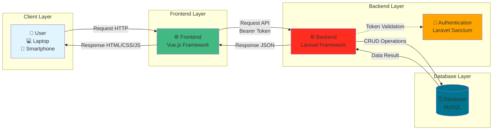
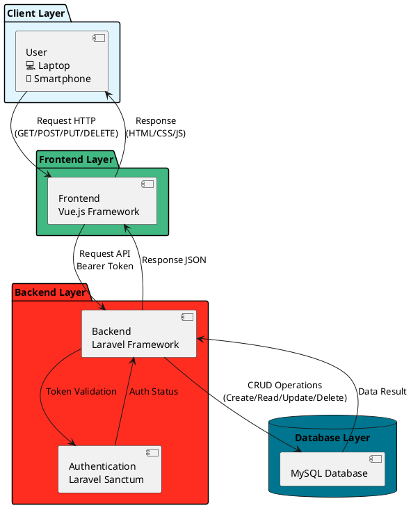

# 🏗️ Diagram Arsitektur Sistem Hopemedia.id

## 📊 Diagram Arsitektur (Mermaid)

Copy kode di bawah ini ke:
- **VS Code** dengan extension Mermaid Preview
- **Online**: https://mermaid.live/
- **Notion** atau **Obsidian** (support Mermaid)



---

## 📐 Diagram Arsitektur (ASCII Art)

```
┌─────────────────────────────────────────────────────────────────┐
│                    ARSITEKTUR SISTEM HOPEMEDIA.ID              │
└─────────────────────────────────────────────────────────────────┘

┌──────────────┐         ┌──────────────┐         ┌──────────────┐
│              │         │              │         │              │
│    👤 USER   │         │   FRONTEND   │         │   BACKEND   │
│              │         │              │         │              │
│  💻 Laptop   │◄───────►│   Vue.js     │◄───────►│   Laravel    │
│  📱 Mobile   │ Request │  Framework   │  API    │  Framework   │
│              │ Response│              │  JSON   │  Sanctum     │
│              │         │              │         │  (Auth)       │
└──────────────┘         └──────────────┘         └──────────────┘
                                                           │
                                                           │
                                                           ▼
                                                  ┌──────────────┐
                                                  │              │
                                                  │   DATABASE   │
                                                  │              │
                                                  │    MySQL     │
                                                  │              │
                                                  └──────────────┘

ALUR KERJA:
1. User mengakses hopemedia.id melalui browser
2. Frontend (Vue.js) menerima request dan render UI
3. Frontend mengirim API request ke Backend (Laravel) dengan Bearer Token
4. Backend validasi token melalui Laravel Sanctum
5. Backend melakukan CRUD operations ke Database MySQL
6. Database mengembalikan data ke Backend
7. Backend mengembalikan response JSON ke Frontend
8. Frontend menampilkan data ke User melalui UI
```

---

## 🎨 Diagram Arsitektur (PlantUML)

Copy kode di bawah ini ke: https://www.plantuml.com/plantuml/uml/



---

## 📋 Deskripsi untuk Gambar Manual (PowerPoint/Figma/Canva)

### **Komponen yang Perlu Ada:**

**1. User (Posisi: Kiri)**
- Icon: Laptop + Smartphone
- Label: "User"
- Deskripsi: "Laptop & Smartphone"
- Warna: Biru muda (#E1F5FF)

**2. Frontend (Posisi: Tengah Kiri)**
- Icon: Vue.js logo (hijau)
- Label: "Frontend"
- Teknologi: "Vue.js Framework"
- Warna: Hijau (#42B883)

**3. Backend (Posisi: Tengah Kanan)**
- Icon: Laravel logo (merah)
- Label: "Backend"
- Teknologi: "Laravel Framework"
- Sub-label: "Laravel Sanctum (Authentication)"
- Warna: Merah (#FF2D20)

**4. Database (Posisi: Kanan)**
- Icon: Database cylinder + MySQL logo
- Label: "Database"
- Teknologi: "MySQL"
- Warna: Biru tua (#00758F)

### **Panah dan Label:**

**User ↔ Frontend:**
- Panah atas (User → Frontend): "Request HTTP"
- Panah bawah (Frontend → User): "Response"

**Frontend ↔ Backend:**
- Panah atas (Frontend → Backend): "Request API (Bearer Token)"
- Panah bawah (Backend → Frontend): "Response JSON"

**Backend ↔ Database:**
- Panah atas (Backend → Database): "CRUD Operations"
- Panah bawah (Database → Backend): "Data Result"

**Backend → Authentication:**
- Panah (Backend → Auth): "Token Validation"

### **Layout:**
- Horizontal flow (kiri ke kanan)
- User → Frontend → Backend → Database
- Authentication sebagai sub-komponen Backend

---

## 🎯 Quick Reference

**Teknologi yang Digunakan:**
- **Frontend**: Vue.js Framework
- **Backend**: Laravel Framework
- **Authentication**: Laravel Sanctum (Token-based)
- **Database**: MySQL

**Format Komunikasi:**
- User ↔ Frontend: HTTP Request/Response
- Frontend ↔ Backend: RESTful API (JSON format)
- Backend ↔ Database: SQL Queries (CRUD operations)

**Alur Data:**
1. User mengirim request HTTP ke Frontend
2. Frontend mengirim request API dengan Bearer Token ke Backend
3. Backend validasi token melalui Laravel Sanctum
4. Backend melakukan operasi CRUD ke Database MySQL
5. Database mengembalikan data ke Backend
6. Backend mengembalikan response JSON ke Frontend
7. Frontend menampilkan data ke User melalui UI

---

## 💡 Cara Menggunakan

### **Opsi 1: Mermaid (Paling Mudah)**
1. Buka https://mermaid.live/
2. Copy kode Mermaid di atas
3. Paste dan lihat hasilnya
4. Export sebagai PNG/SVG

### **Opsi 2: Draw.io (Manual)**
1. Buka https://app.diagrams.net/
2. Buat diagram sesuai deskripsi di atas
3. Gunakan warna dan label yang sudah ditentukan
4. Export sebagai PNG/PDF

### **Opsi 3: PowerPoint/Figma**
1. Buat 4 kotak sesuai komponen di atas
2. Tambahkan panah dengan label
3. Gunakan warna yang sudah ditentukan
4. Export sebagai gambar

---

**Diagram ini sesuai dengan arsitektur sistem hopemedia.id yang sebenarnya!**
